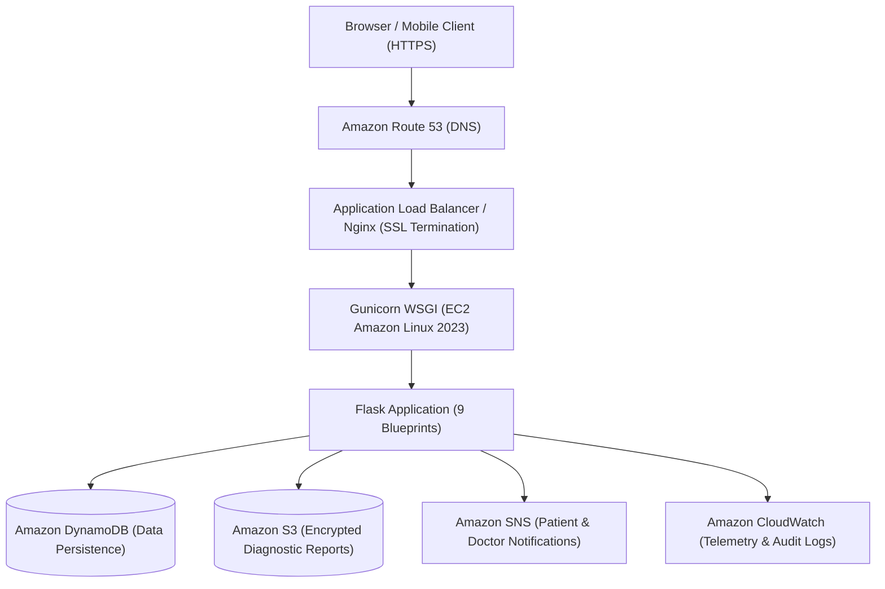

# MedTrack — Cloud Healthcare Management Platform


> **Important Healthcare Safety Notice:**
> MedTrack is a centralized healthcare management and communication platform designed to improve coordination between patients and licensed physicians. MedTrack **does not** provide autonomous diagnoses or replace professional medical advice.

---

## 1. Executive Summary & Product Vision

MedTrack connects patients and doctors through secure appointment management, medical records, diagnostic reports, and real-time AWS SNS notifications. Built with enterprise-grade cloud architecture, least-privilege security, and role-based access control (RBAC).

---

## 2. Cloud Architecture

### End-to-End AWS Flow



---

## 3. Demo Credentials

| Role | Name | Email | Password | Access / Function |
|---|---|---|---|---|
| **Admin** | MedTrack Administrator | `admin@medtrack.demo` | `Admin@12345` | System oversight, user toggling, audit trails |
| **Doctor** | Dr. Rohan Mehta | `rohan@medtrack.demo` | `Doctor@12345` | General Physician (Consultation & records) |
| **Doctor** | Dr. Priya Kulkarni | `priya@medtrack.demo` | `Doctor@12345` | Dermatologist (Consultation & records) |
| **Doctor** | Dr. Aditya Shah | `aditya@medtrack.demo` | `Doctor@12345` | Cardiologist (Consultation & records) |
| **Patient** | Aarav Sharma | `aarav@medtrack.demo` | `Patient@12345` | Patient profile with pre-seeded appointments |
| **Patient** | Ananya Patil | `ananya@medtrack.demo` | `Patient@12345` | Patient profile with records & reports |

---

## 4. DynamoDB Data Model & Access Patterns

MedTrack utilizes single-table or entity-partitioned access patterns:

| Entity | Primary Key (PK) | Sort Key (SK) | GSI 1 (PK / SK) | Purpose / Access Pattern |
|---|---|---|---|---|
| **Users** | `USER#<id>` | `METADATA` | `EMAIL#<email>` | Fast login & role verification |
| **Patients** | `PATIENT#<id>` | `PROFILE` | `USER#<user_id>` | Demographic & emergency contact lookups |
| **Doctors** | `DOCTOR#<id>` | `PROFILE` | `SPEC#<specialization>` | Doctor discovery & schedule lookups |
| **Appointments** | `APPT#<id>` | `METADATA` | `PATIENT#<id>` / `DATE#<date>` | Patient timeline & doctor schedule checks |
| **MedicalRecords**| `RECORD#<id>` | `DATE#<date>` | `PATIENT#<id>` / `DATE#<date>` | Chronological medical history |
| **Reports** | `REPORT#<id>` | `DATE#<date>` | `PATIENT#<id>` / `STATUS` | Secure document metadata retrieval |
| **Notifications** | `USER#<id>` | `NOTIF#<timestamp>` | `READ#<0\|1>` | Unread notifications badge & bell queries |
| **AuditLogs** | `AUDIT#<id>` | `TIME#<timestamp>` | `ACTOR#<id>` | Security compliance & access inspection |

---

## 5. Security & RBAC Architecture

1. **Role Separation**: Strict `@login_required(roles=[...])` decorators guarding every route.
2. **Context-Aware Doctor Access**: Doctors can **only** view records for patients who have booked consultations with them.
3. **Password Security**: Salted SHA-256 hashes generated via Werkzeug security primitives.
4. **CSRF & Session Defense**: Cryptographic session tokens, SameSite cookies, and automated form token verification.
5. **Rate Limiting**: Brute-force protection on authentication endpoints.
6. **File Integrity**: Whitelisted extensions (`.pdf`, `.png`, `.jpg`), UUID-randomized filenames, zero direct filesystem exposure.

---

## 6. AWS IAM Least Privilege Policy

Attach this policy to the EC2 Instance IAM Role (do **not** hardcode credentials):

```json
{
  "Version": "2012-10-17",
  "Statement": [
    {
      "Sid": "MedTrackDynamoDBAccess",
      "Effect": "Allow",
      "Action": [
        "dynamodb:GetItem",
        "dynamodb:PutItem",
        "dynamodb:UpdateItem",
        "dynamodb:DeleteItem",
        "dynamodb:Query"
      ],
      "Resource": "arn:aws:dynamodb:*:*:table/MedTrack-*"
    },
    {
      "Sid": "MedTrackSNSPublish",
      "Effect": "Allow",
      "Action": [
        "sns:Publish"
      ],
      "Resource": "arn:aws:sns:*:*:medtrack-notifications-*"
    },
    {
      "Sid": "MedTrackS3Reports",
      "Effect": "Allow",
      "Action": [
        "s3:GetObject",
        "s3:PutObject"
      ],
      "Resource": "arn:aws:s3:::medtrack-medical-reports-*/*"
    },
    {
      "Sid": "MedTrackCloudWatchLogs",
      "Effect": "Allow",
      "Action": [
        "logs:CreateLogGroup",
        "logs:CreateLogStream",
        "logs:PutLogEvents"
      ],
      "Resource": "arn:aws:logs:*:*:*"
    }
  ]
}
```

---

## 7. Local Development & Deployment

### Quick Start

```bash
# 1. Clone & create virtual environment
python -m venv venv
source venv/bin/activate  # Or on Windows: .\venv\Scripts\activate

# 2. Install dependencies
pip install -r requirements.txt

# 3. Configure environment
cp .env.example .env

# 4. Run application
python run.py
```
Open **http://127.0.0.1:5000** in your browser.

### Running Test Suite

```bash
python tests/test_suite.py
```

---

## 8. AWS EC2 Production Deployment

```bash
# Execute automated deployment script on Amazon Linux 2023:
chmod +x deployment/deploy.sh
./deployment/deploy.sh
```

---

## 9. RESTful API Documentation

| Method | Endpoint | Description |
|---|---|---|
| `GET` | `/api/health` | Service health status check |
| `GET` | `/api/doctors` | List doctors with optional search filters |
| `GET` | `/api/doctors/<id>` | Retrieve specific doctor profile & slots |
| `GET` | `/api/appointments` | Current user's appointment records |
| `GET` | `/api/notifications` | Current user's notification list |
| `PUT` | `/api/notifications/<id>/read` | Mark individual notification as read |
| `POST`| `/api/auth/login` | JSON authentication endpoint |
